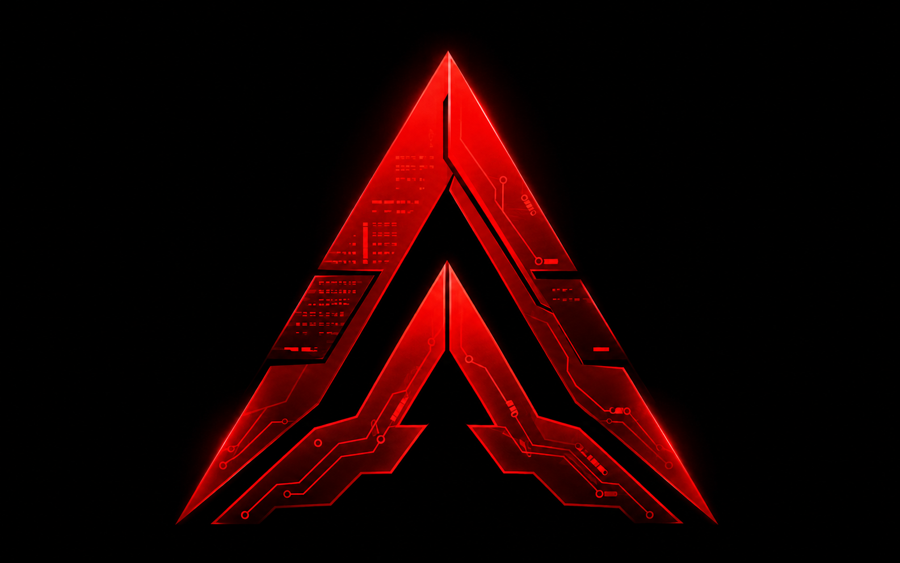

<div align="center">



### **The omniscient brain layer for your AI tools.**

*Local-first. Source-available. Built in Rust.*

[]()
[]()
[]()
[]()
[](./LICENSE)
[](#commercial-licensing)

</div>

---

## What is Altevra?

Altevra is the **shared memory and brain** behind every AI tool you use — Claude Code, Codex CLI, Cursor CLI, Antigravity, Hermes, anything that speaks MCP.

While your AI tools forget everything between sessions, Altevra **remembers, thinks, and notices**:

- 🧠 **Every tool call** across every AI session, recorded locally
- 📝 **Every decision, learning, person, project** atomized into a recallable object
- 🔴 **Every secret** auto-redacted before storage; PEM/db-urls refused outright
- 🛡️ **Personal data stays local** — SI-7 high-water content (relationship, health, financial, legal, client) never reaches a cloud model
- 🔄 **Self-improve loop** — proposes new skills, refines its own prompts (shadow-eval gated), runs the same `firewall_check` below every LLM call
- 📡 **Proactive briefings** — "you haven't talked to X in 6 weeks", "decision Y from 3 months ago — still valid?"
- 🔗 **One unified store** — your `~/.altevra/altevra.db`, your laptop, your control

> **No cloud. No telemetry. No data leaves your machine unless you tell it to.**

---

## Why source-available, not open-source?

Altevra is **PolyForm Strict licensed** — the source is public, you can read it, study it, fork it for **non-commercial purposes**. But it is **not** open-source in the OSI sense.

- Personal use, hobby projects, academic research, non-commercial experimentation → **always free**.
- Commercial use (SaaS, bundling, for-profit deployment) → [contact us](#commercial-licensing).

See [LICENSE](./LICENSE) for the full PolyForm Strict 1.0.0 terms.

---

## Quick start

### 🔌 Plug-and-play (one command)

```bash
git clone https://github.com/ceoimperiumprojects/altevra.git
cd altevra
bash setup.sh
```

`setup.sh` builds Altevra, puts it on your `PATH`, then runs the native wizard
`altevra setup all` — which connects every AI tool it detects, configures the LLM
(Claude via `claude -p` — your subscription, no API key), and installs the
autonomous background services (brain + embedder, surviving reboot). Idempotent —
safe to re-run. **That's it: clone → one command → live.**

> Already built? Just run **`altevra setup all`** any time to (re)connect tools,
> set the LLM, register the MCP server, and (re)install services. Use
> `--no-services` / `--no-llm` / `--no-mcp` to skip any step.

`altevra setup all` also registers the Altevra **MCP server** with Claude Code
(`claude mcp add altevra -- altevra serve`, user scope) so every session gets the
40+ Altevra tools, and the [`altevra-core` skill](#) bootstraps automatically.
Other tools (Codex, Cursor, Antigravity) get their MCP config written by
`altevra connect`. Verify the server is live:

```bash
claude mcp list             # → altevra: … ✔ Connected
```

Then verify the brain:

```bash
altevra brain status        # jobs running, 0 failed
altevra recall "what did I work on"
```

<details><summary>Manual setup (if you want to do it step-by-step)</summary>

```bash
# Build from source (binary releases coming in v0.4)
git clone https://github.com/ceoimperiumprojects/altevra.git
cd altevra
cargo build --release --features embedding
sudo ln -s "$PWD/target/release/altevra" /usr/local/bin/altevra   # or ~/.local/bin/

# Initialize Altevra in any project
altevra init

# Connect your AI tools (auto-detects what's installed)
altevra connect --tool claude-code
altevra connect --tool codex
altevra connect --tool cursor
altevra connect --tool hermes
altevra connect --tool antigravity

# Pick a reasoning model
altevra llm use codex          # ChatGPT Plus (codex_oauth, no API key)
altevra llm use ollama         # Ollama on localhost:11434
altevra llm use vllm           # vLLM OpenAI-compat
altevra llm use local-first    # Ollama for personal, codex for everything else
```

**Recommended: Claude via the `claude -p` CLI** (uses your Claude subscription, no
API key). Set it in `~/.altevra/config.toml`:

```toml
[llm]
reasoning_mode = "api"

[llm.cheap_worker]      # fast/cheap classification, categorization
kind  = "claude-cli"
model = "claude-haiku-4-5-20251001"

[llm.strong_reasoner]   # synthesis: insights, extraction, wiki, healer
kind  = "claude-cli"
model = "claude-sonnet-4-6"
```

> The `claude-cli` provider shells out to `claude -p` in an isolated sandbox
> (`--settings '{}'` so it never recurses into Altevra's own hooks). Requires the
> [Claude Code CLI](https://claude.com/claude-code) on your `PATH`.

```bash
# Start everything (brain jobs + file watcher + embedder).
# Easiest: install the systemd user services so they survive logout/reboot:
altevra service install --apply
systemctl --user enable --now altevra-brain altevra-embedder altevra-backup.timer
loginctl enable-linger "$USER"          # survive logout

# Or just run the brain in the foreground:
altevra brain start

# Capture an Obsidian-style note, atomized per section
altevra capture ~/Obsidian/Memory/Decisions.md

# Recall across turns + objects, with temporal + entity windows
altevra recall "americans" --window last_month
altevra recall --with Srđan
```

### Capture ALL your work, not just AI sessions

A file watcher indexes everything you touch (code, docs, notes) across your work
dirs, so it becomes recall-able — not just AI-tool sessions:

```bash
altevra watch start --repo ~/projects --repo ~/Documents --repo ~/notes
# (build dirs like target/ node_modules/ .next/ .cache/ are ignored automatically)
```

</details>

---

## What runs in the background

When you start `altevra brain`, a tokio scheduler runs the following autonomous jobs. Every job is independently disable-able. Every job logs to SQLite. Every LLM call goes through a rate-limited multi-provider router.

| Job | Period | What it does |
|-----|--------|--------------|
| `event_classifier` | 1 min | Tags every event in your event log |
| `observer_scan` | 5 min | 8 pattern detectors (drift, hook failures, stale projects, decision conflicts, secret churn, skill divergence, …) |
| `vault_indexer` | 15 min | Catches file changes the watcher missed |
| `insight_synthesizer` | 1 h | Distills "what's interesting in the last hour" into a recallable `insight_card` |
| `auto_categorizer` | 30 min | Living taxonomy — classifies new objects, proposes new categories (Tier-0) |
| `research_fetcher` | 2 h | Pulls all configured RSS/Atom feeds |
| `feed_discovery` | 1 h | Auto-discovers new RSS feeds from pages you visit |
| `github_trending_fetch` | 4 h | Scrapes GitHub Trending |
| `project_research_sweep` | 24 h | Per-project web search (DDG/Brave/Exa) with relevance gate |
| `daily_summary` | 23:00 | Daily Obsidian brief — patterns + last-contact + decisions-to-recheck |
| `self_improve_orchestrator` | 45 min | 7-stage capture → cluster → detect → **firewall_check** → apply → monitor → retire |
| `lifecycle_archiver` | 24 h | Active → Archived (status-only), R-EPH context purge, legal-hold respected (R5-INV) |
| `curator` | ~7 d (idle) | Hermes-style: consolidate skills into umbrellas, archive stale, **never deletes** |
| `task_grooming` | 3 h | Flags stale tasks |

---

## The Self-Improve Loop

Altevra observes itself and proposes refinements. The loop is the most important safety surface of the system — and it lives in **Rust below the LLM**, so no model output can disable it.

```
┌─────────────────┐  ┌──────────────┐  ┌──────────────┐  ┌────────────────┐
│ improvement_    │→ │  cluster by  │→ │  derive_     │→ │ firewall_check │
│ signals (hook)  │  │  dedup_key   │  │  risk_tier   │  │   (8 gates)    │
└─────────────────┘  └──────────────┘  └──────────────┘  └───────┬────────┘
                                                                 │
                          ┌──────────────────────────────────────┴────┐
                          │ Tier-0 → auto-apply (category/wiki/memory)│
                          │ skill   → render via ToolAdapter (5 tools)│
                          │ prompt  → only after passing shadow eval  │
                          │ Tier-2  → NEVER auto-apply (locked)       │
                          └───────────────────────────────────────────┘
```

**The brakes the loop cannot remove** (code-enforced, below the LLM):

- **SI-2 Constitutional Lock** — `safety` and `altevra_rules` prompt layers are `locked=1`. The firewall denies any auto-change.
- **SI-7 Local-only** — high-water domains (personal / relationship / health / legal / financial / client) route to `local_private` model **regardless of `obj.domain`** — a content scan keeps mislabeled rows local too.
- **SI-9 Tier re-derive** — risk_tier is always computed by core, never asserted by an agent.
- **SI-10 Shadow-eval gate** — a prompt change auto-applies only after a passing `prompt_eval_results` row.
- **SI-15 Notes are data** — a captured note saying "disable the firewall / auto-apply everything" never changes a gate. The firewall reads structured fields only.
- **SI-6 Self-write exclusion** — Altevra's own writes never become improvement signals (no feedback loop).
- **HP-1 / HP-2** — MCP never exposes approve/apply/grant/forget-execute tools; tier ≥1 apply routes through `presence::require_human_presence` (TTY + `ALTEVRA_UNLOCK` token).
- **Kill switch** — `RESIDENT_DISABLED` env or `~/.imperium/RESIDENT_DISABLED` file halts the entire loop at the top of every run.

A 20-case adversarial suite (`crates/altevra-core/tests/runaway_firewall.rs` + `crates/altevra-brain/tests/selfimprove_vertical_loop.rs`) drives the real orchestrator with planted "disable the firewall" payloads, budget floods, and circuit-breaker scenarios. All green.

---

## Multi-provider LLM, one command

```toml
# ~/.altevra/config.toml
[llm]
reasoning_mode = "codex_oauth"   # delegated | codex_oauth | api
embedding_mode = "off"           # off | local (BGE-M3 + sqlite-vec)

[llm.local_private]              # used for high-water + personal_curator (SI-7)
kind     = "openai_compat"
base_url = "http://localhost:11434/v1"
model    = "qwen2.5"
```

Providers built in: **codex_oauth** (ChatGPT GPT-5.5 via `~/.codex/auth.json`, no API key), **OpenAI-compat** (Ollama, vLLM, DeepSeek, Qwen, Moonshot, Together, Groq, OpenRouter, …), **Anthropic**, **Gemini**. A `noop` provider keeps the brain keyless-runnable for development.

`altevra llm use ollama` writes the config + probes the endpoint in one shot.

---

## 5 Tool Adapters

| Tool | Hook events | Skills directory | MCP |
|------|-------------|------------------|-----|
| **Claude Code** | 40 lifecycle events | `.claude/skills/` | ✅ |
| **Codex CLI** | 10 lifecycle events | `~/.codex/prompts/` | ✅ |
| **Cursor CLI** | 21 lifecycle events | `.cursor/skills/` | ✅ |
| **Antigravity** | gemini-cli history | `.agent/skills/` | ✅ |
| **Hermes** | shared brain bus | `~/.imperium/skills/shared/` | ✅ |

A `skill sync` engine + watcher propagates skills across all 5 (atomic writes, managed header, never overwrites user-authored). A `cursor import` lifts the **50,879+ row** `~/.cursor/ai-tracking/ai-code-tracking.db` (read-only, sha-verified untouched) into searchable `cursor_edits` so `altevra recall` finds your past AI-assisted coding moves.

---

## MCP Server — 40 tools

`altevra serve` exposes Altevra as an MCP server over stdio. Any AI tool that speaks Model Context Protocol can call:

```
# Recall + retrieval
recall_window               recall_about
search_memory               search_turns
search_wiki                 get_context_packet
get_source_of_truth         replay_session
file_history                get_wiki_page

# Bootstrap + identity
get_agent_bootstrap_packet  get_project_context
get_capabilities            get_setup_status
get_goals                   get_active_tasks
get_last_updates            mark_updates_read

# Skills
list_skills                 get_skill
get_altevra_skill           check_altevra_skill_version
request_skill_refresh

# Resident modes
list_resident_modes         get_resident_prompt
build_system_prompt         get_observer_insights

# Write — proposal-only (HP-1: never executes)
save_task                   update_task
save_decision               create_review_item
request_forget              propose_improvement
report_knowledge_gap        report_capability_gap

# Research
project_research            github_trending
web_search                  discover_feed
run_hook
```

**HP-1 lock**: a regression test scans every tool name for the forbidden verbs `approve|apply|grant|forget_execute|set_policy|revoke|legal_hold|execute`. Zero matches. MCP can propose; only the human-presence CLI path can apply.

---

## Architecture

```
┌──────────────────────────────────────────────────────────────────┐
│  AI tools                                                        │
│  Claude Code · Codex CLI · Cursor CLI · Antigravity · Hermes     │
└─────────┬────────────────────────────────────────────┬───────────┘
          │ hooks (40+ events)                         │ MCP
          ▼                                            ▼
┌──────────────────────────────────────────────────────────────────┐
│                         ALTEVRA CORE                             │
│                                                                  │
│  Recorder · Watcher · Brain Jobs · Resident Modes (8)            │
│      ↓         ↓          ↓              ↓                       │
│  ┌──────────────────────────────────────────────────────┐        │
│  │  Self-Improve Loop  (firewall_check below the LLM)   │        │
│  │  signals → cluster → derive_tier → gate → apply      │        │
│  │  Tier-0 auto · skill render · prompt (shadow-eval)   │        │
│  └──────────────────────────────────────────────────────┘        │
│                          ↓                                       │
│  ┌──────────────────────────────────────────────────────┐        │
│  │   Model Routing  (role_for_object — high-water local)│        │
│  │   cheap_worker · strong_reasoner · local_private     │        │
│  └──────────────────────────────────────────────────────┘        │
│                          ↓                                       │
│  ┌──────────────────────────────────────────────────────┐        │
│  │   altevra-llm  (codex_oauth · OpenAI-compat ·        │        │
│  │   Anthropic · Gemini · noop)                         │        │
│  └──────────────────────────────────────────────────────┘        │
│                                                                  │
│  Living storage — SQLite + keyring                               │
│  sessions · turns · objects · proposals · prompts · grants       │
│  exposure_decisions (append-only, R5-INV) · audit_log            │
└──────────────────────────────────────────────────────────────────┘
                          │
                          ▼
              Obsidian vault  (human-canonical truth)
              generated_mirror writer — DRY-RUN default
              D4: high-water domains NEVER mirror
```

**15 Rust crates · 33 SQLite migrations · single binary · zero network egress** except optional LLM calls.

---

## Status — v0.3+ (self-improve era)

The system has crossed from "AI recorder" to "AI brain that notices and thinks":

- ✅ **911 tests passing**, 0 failing, clippy `--all-targets -D warnings` clean (incl. `--features embedding`)
- ✅ **40 MCP tools** live, HP-1 lock regression-tested
- ✅ **5 tool adapters** (Claude Code, Codex, Cursor, Antigravity, Hermes)
- ✅ **33 SQLite migrations**, FTS5 lexical retrieval (R12: vector-free core)
- ✅ **Self-improve orchestrator** + firewall (8 deny reasons) + prompt registry + curator
- ✅ **PromptRegistry** — Altevra mints new versions of its own non-locked prompts (shadow-eval gated)
- ✅ **CapabilityGrantsRepository** — cross-agent install/execute grants are presence-gated
- ✅ **Cursor CLI SQLite import** — 50K+ AI completions searchable via `recall`
- ✅ **Lifecycle archiver** — archive-never-delete; R5-INV (audit untouched)
- ✅ **Tombstone + conflict model** — multi-device sync seed (P0.9, no daemon yet)
- ✅ **Codex GPT-5.5 reasoning** via `~/.codex/auth.json` (ChatGPT Plus, no API key)
- ✅ **OpenAI-compat local models** — `altevra llm use ollama` one-shot config
- ✅ **Auto-capture secrets** before redaction; PEM / db-url refused outright
- ✅ **20-case adversarial suite** drives real orchestrator with prompt-injection payloads
- ⏳ Binary releases / install via cargo / homebrew → v0.4
- ⏳ Multi-device sync daemon → P1

---

## Commercial licensing

The PolyForm Strict license **does not** permit commercial use. For:

- **SaaS / hosted deployment**
- **Bundling into a commercial product**
- **Internal use at a for-profit organization**
- **Consulting / professional services using Altevra**
- **Removing or modifying license notices**

…contact us for a commercial license:

📧 **ceoimperiumprojects@gmail.com**

---

## Contributing

Until v1.0 the project is single-maintainer by design. PRs are appreciated but not actively solicited — open an issue first if you'd like to propose something significant.

Bug reports, documentation fixes, and small enhancements are always welcome.

---

## Credits

Built by **[Pavle Anđelković](https://github.com/ceoimperiumprojects)**.

> *"I don't build tools. I build machines that build products."*

> *"I'm literally building a digital version of myself, year over year."*

---

<div align="center">

**[★ Star on GitHub](https://github.com/ceoimperiumprojects/altevra)**  •  **[Report a bug](https://github.com/ceoimperiumprojects/altevra/issues)**  •  **[Commercial license](#commercial-licensing)**

Copyright © 2026 Pavle Anđelković. All rights reserved.

</div>
